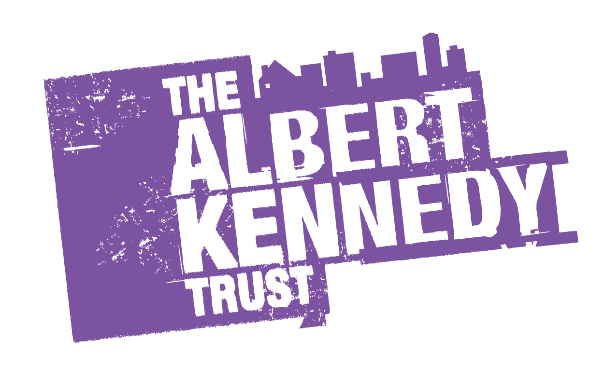

# Albert Kennedy Trust

[View our app on Heroku](http://inter-akt.herokuapp.com/)

### The LGBT+ youth homelessness charity

#### inter-AKT: Connecting young people within the LBGT+ community to digital mentors. 👩🏻‍💻👨🏼‍💻



### Running our project locally 🤓

**Requirements**

PostgreSQL, Node

**Installation**

```
git clone https://github.com/fac-12/Albert-Kennedy.git && cd Albert-Kennedy && npm i
```

Create a `config.env` file in the root directory with the following environment variables:

* `DATABASE_URL=`[a url to a PostgreSQL Database, setup with our `db_build.sql`]
* `SECRET=`[a secret sequence of letters / numbers for signing JWT tokens]

**Run a Dev Server**

```
npm run dev
```

## What?

We have built a mobile first web app that connects any young person in the U.K with a mentor from Albert Kennedy Trust.

The app was not only built to offer young people support. Inter-AKT asks first time users whether they fall into the brackets of Albert Kennedy Trust's target user group, which filters out users not within Albert Kennedy Trust's user group and informs them of which organisations can offer support.

## Why?

Albert Kennedy Trust offers mentors to young people in the U.K within the LGBT+ community who need someone to talk to. 🌈

Currently, there is no way to connect young people with mentors on a national level. With head offices in London, Manchester and Newcastle it can be difficult for young people to access support.

<b>inter-AKT app aims to solve that problem.</b>

## How?

inter-AKT allows users to register for an account, log in, view their upcoming appointments, schedule a new appointment and join existing appointments via an external chat platform. 💬

### Our Stack:

⚛️ React, Redux, PostgreSQL, 💚 Node.js, Express

<b>We also used:</b>

💌 Nodemailer, 📊 Google Sheets, Passport, 💅 Styled Components
